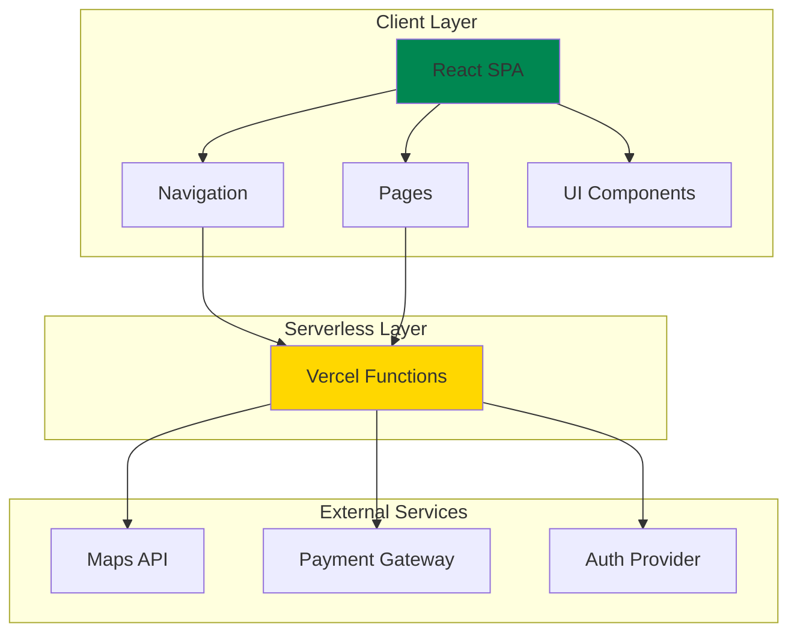
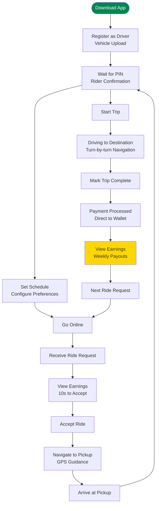
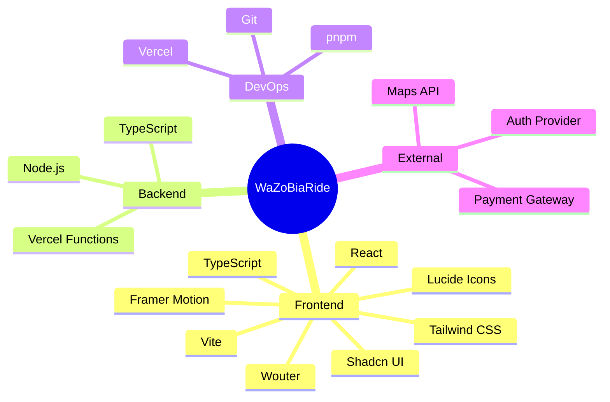

# WaZoBiaRide 🇳🇬

## Executive Summary

WaZoBiaRide is a Nigeria-first ride-hailing platform targeting South West Nigeria, with initial operations focused on Lagos and Ibadan. Built to serve the unique needs of Nigerian commuters and drivers, the platform prioritizes safety, affordability, and community empowerment.

### Target Market
- **Primary Region**: South West Nigeria (Lagos, Ibadan, Abeokuta, Osogbo)
- **Population Coverage**: 35-40 million residents
- **Demographic**: 60%+ under 35 years, ~50-60% smartphone penetration

### Key Differentiators
1. **PIN Verification System** - Safety-first pickup confirmation
2. **Timed Driver Dispatch** - 5-10 second sequential acceptance algorithm
3. **Premium vs Standard Tier** - Flexible service levels for different user segments
4. **Upfront Driver Earnings** - Transparency for driver recruitment and retention
5. **Local-First Approach** - Built by Nigerians, for Nigerians

### Financial Goals
- **Year 5 Target**: $20M net profit
- **Revenue Model**: 20-25% commission on rides + ancillary services
- **Initial Capital**: $10-15M for tech, operations, and marketing

---

## Table of Contents

- [Quick Start](#quick-start)
- [Project Setup](#project-setup)
- [Development Workflow](#development-workflow)
- [Deployment to Vercel](#deployment-to-vercel)
- [Architecture Overview](#architecture-overview)
- [Tech Stack](#tech-stack)
- [Features](#features)
- [Business Plan](#business-plan)

---

## Quick Start

```bash
# Install dependencies
pnpm install

# Start development server
pnpm dev

# Build for production
pnpm build

# Preview production build
pnpm preview
```

---

## Project Setup

### Prerequisites
- Node.js 18+ 
- pnpm package manager
- Git

### Installation

1. **Clone the repository**
   ```bash
   git clone <repository-url>
   cd WAZOBIARIDE
   ```

2. **Install dependencies**
   ```bash
   pnpm install
   ```

3. **Configure environment variables**
   ```bash
   # Create .env.local file
   VITE_API_URL=https://api.wazobiaride.com
   ```

4. **Start development server**
   ```bash
   pnpm dev
   ```

The application will be available at `http://localhost:5173`

---

## Development Workflow

### Project Structure

```
WAZOBIARIDE/
├── client/                 # Frontend React application
│   ├── public/            # Static assets
│   │   └── images/         # Images, logos, assets
│   └── src/
│       ├── components/       # Reusable UI components
│       │   ├── ui/          # Shadcn UI components
│       │   ├── Map.tsx      # Map component
│       │   └── ErrorBoundary.tsx
│       ├── contexts/         # React contexts
│       ├── hooks/            # Custom React hooks
│       ├── lib/             # Utility functions
│       ├── pages/           # Page components
│       │   ├── Home.tsx    # Landing page
│       │   └── NotFound.tsx
│       ├── App.tsx          # Main app component
│       ├── index.css        # Global styles
│       └── main.tsx         # Entry point
├── server/                # Serverless functions
│   └── index.ts          # Vercel API routes
├── shared/                # Shared utilities
├── docs/                  # Documentation
├── package.json            # Dependencies and scripts
├── tsconfig.json          # TypeScript configuration
├── vite.config.ts         # Vite configuration
└── vercel.json           # Vercel deployment config
```

### Available Scripts

```json
{
  "dev": "vite",
  "build": "tsc -b && vite build",
  "preview": "vite preview",
  "lint": "eslint .",
  "type-check": "tsc --noEmit"
}
```

### Code Style

This project uses:
- **Prettier** for code formatting
- **ESLint** for linting
- **TypeScript** for type safety

Run formatting before committing:
```bash
pnpm lint --fix
```

---

## Deployment to Vercel

### Prerequisites
1. Vercel account (free tier works)
2. Git repository (GitHub, GitLab, or Bitbucket)

### Deployment Steps

#### 1. Connect Repository

1. Go to [vercel.com](https://vercel.com)
2. Click "Add New Project"
3. Connect your Git repository

#### 2. Configure Project

Vercel will automatically detect the framework. Configure:

```json
{
  "framework": "vite",
  "buildCommand": "pnpm build",
  "outputDirectory": "dist"
}
```

#### 3. Environment Variables

Add the following in Vercel dashboard:

```bash
NODE_VERSION=18
PNPM_VERSION=8
```

#### 4. Deploy

Click "Deploy". Vercel will:
1. Install dependencies
2. Build the project
3. Deploy to edge network
4. Provide a production URL

#### 5. Custom Domain (Optional)

1. Go to Project Settings > Domains
2. Add your custom domain
3. Update DNS records as instructed

### Manual Deployment via CLI

```bash
# Install Vercel CLI
npm i -g vercel

# Deploy from project root
vercel

# Deploy to production
vercel --prod
```

### Vercel Configuration

The `vercel.json` file handles routing and function configuration:

```json
{
  "buildCommand": "pnpm build",
  "outputDirectory": "dist",
  "functions": {
    "api/**/*.ts": {
      "maxDuration": 10
    }
  },
  "rewrites": [
    {
      "source": "/api/(.*)",
      "destination": "/api/index"
    },
    {
      "source": "/(.*)",
      "destination": "/index.html"
    }
  ]
}
```

---

## Architecture Overview

### System Architecture



### Ride Flow

```mermaid
sequenceDiagram
    participant R as Rider
    participant App as Mobile App
    participant API as WaZoBiaRide API
    participant D as Driver
    participant Map as Maps Service
    
    R->>App: Enter Destination
    App->>API: Get Fare Estimate
    API-->>App: Return Fare
    App->>R: Display Fare Options
    R->>App: Select Tier & Confirm
    App->>API: Create Ride Request
    
    API->>API: Sequential Dispatch (5-10s)
    
    par Available Drivers
        API->>D: Send Ride Notification
        API->>D: Driver 2
        API->>D: Driver 3
    and
    
    D->>API: Accept Ride
    API-->>App: Driver Matched
    App->>Map: Show Driver Location
    
    D->>App: Navigate to Pickup
    D->>R: Arrived at Pickup
    R->>App: Enter PIN (Verification)
    App->>API: Verify PIN
    API-->>App: PIN Confirmed
    D->>R: Start Trip
    App->>Map: Track Real-Time Location
    
    D->>App: Arrive at Destination
    App->>API: Complete Trip
    API->>App: Calculate Final Fare
    App->>R: Request Payment
    App->>D: Process Payment
    API->>API: Generate Receipt
    API-->>R: Trip Summary
```

### User Journey - Rider

```mermaid
flowchart TD
    Start([Download App]) --> Register[Create Account<br/>Phone Verification]
    Register --> Home[Home Screen]
    Home --> Choose[Enter Destination]
    Choose --> Select[Select Service Tier<br/>Car | Okada | Share]
    Select --> Quote[View Fare Estimate]
    Quote --> Request[Request Ride]
    
    Request --> Wait[Wait for Driver]
    Wait --> Match[Driver Matched<br/>~2-3 min avg]
    Match --> Pickup[Driver Arriving<br/>Track on Map]
    Pickup --> Verify[Enter PIN<br/>Safety Verification]
    Verify --> Ride[Trip in Progress<br/>Real-time Tracking]
    Ride --> Arrival[Arrived at Destination]
    Arrival --> Pay[Select Payment<br/>Cash | Card | Mobile Money]
    Pay --> Rate[Rate Experience<br/>1-5 Stars]
    Rate --> End[Trip Complete]
    
    style Start fill:#008751,color:#fff
    style End fill:#008751,color:#fff
    style Pay fill:#FFD700
    style Verify fill:#FFD700
```

### User Journey - Driver



---

## Tech Stack

### Frontend

| Category | Technology | Purpose |
|-----------|-----------|---------|
| **Framework** | React 18+ | UI library |
| **Build Tool** | Vite | Fast build & dev server |
| **Language** | TypeScript | Type safety |
| **Styling** | Tailwind CSS | Utility-first CSS |
| **Animations** | Framer Motion | Production-ready animations |
| **UI Components** | Shadcn UI | Accessible component library |
| **Routing** | Wouter | Lightweight routing |
| **Icons** | Lucide React | Icon set |

### Backend

| Category | Technology | Purpose |
|-----------|-----------|---------|
| **Platform** | Vercel Functions | Serverless compute |
| **Runtime** | Node.js 18+ | JavaScript runtime |
| **API** | TypeScript/Express-style | RESTful endpoints |

### DevOps

| Category | Technology | Purpose |
|-----------|-----------|---------|
| **Deployment** | Vercel | Edge network deployment |
| **Package Manager** | pnpm | Fast dependency management |
| **Version Control** | Git | Source control |
| **CI/CD** | Vercel | Automated deployment |

### Tech Stack Visualization



---

## Features

### Implemented Features

#### Core Functionality
- ✅ Responsive landing page design
- ✅ Nigeria Unity theme (green, white, gold)
- ✅ Adire pattern backgrounds
- ✅ Animated statistics counter
- ✅ Service tier cards (Car, Okada, Share)
- ✅ How It Works section
- ✅ Safety features showcase
- ✅ Driver recruitment section
- ✅ User testimonials
- ✅ App download CTAs
- ✅ Dark mode support

#### User Interface
- ✅ Mobile-first responsive design
- ✅ Smooth scroll animations
- ✅ Interactive hover states
- ✅ Loading skeletons
- ✅ Navigation menu
- ✅ Footer with social links

### Planned Features

See [TODO.md](./TODO.md) for upcoming features and priorities.

---

## Business Plan

### Market Analysis

#### Nigerian Ride-Hailing Market
- **2026 Valuation**: $300-400M
- **Projected Growth**: 12-16% CAGR to 2029
- **Target Share**: 10-15% in key cities

#### Competitive Advantages

1. **Hyper-Local Integration**
   - Yoruba-language interfaces
   - OPay and PalmPay integration
   - Local driver union partnerships

2. **Safety First**
   - PIN verification at pickup
   - Women-only ride options
   - 24/7 SOS support
   - Real-time trip sharing

3. **Driver Empowerment**
   - Upfront earnings visibility
   - Weekly payouts
   - Flexible scheduling
   - Lower commission rates (target: 15-20%)

4. **Affordability**
   - "Bid-and-match" pricing with AI minimums
   - Okada option for short trips
   - Shared rides to reduce costs

### Revenue Model

#### Commission Structure
- **Rides**: 20-25% commission
- **Standard Tier**: 20%
- **Premium Tier**: 25%
- **Okada**: 15%

#### Ancillary Revenue Streams
- In-app advertising
- Food delivery partnerships
- Corporate accounts
- Vehicle rental to drivers

### Financial Projections

| Year | Active Riders | Monthly Rides | Revenue | Net Profit |
|------|---------------|----------------|---------|------------|
| Year 1 | 100K | 500K | $2.5M | ($3M) |
| Year 2 | 300K | 1.5M | $10M | ($1M) |
| Year 3 | 750K | 3.75M | $30M | $3M |
| Year 4 | 1.5M | 7.5M | $65M | $10M |
| Year 5 | 3M | 15M | $150M | $20M |

---

## Contributing

We welcome contributions! Please follow these steps:

1. Fork the repository
2. Create a feature branch (`git checkout -b feature/amazing-feature`)
3. Commit your changes (`git commit -m 'Add amazing feature'`)
4. Push to the branch (`git push origin feature/amazing-feature`)
5. Open a Pull Request

---

## License

© 2024 WaZoBiaRide Technologies Ltd. All rights reserved.

---

## Contact

- **Website**: https://wazobiaride.com
- **Email**: hello@wazobiaride.com
- **Support**: support@wazobiaride.com

---

**Proudly serving Lagos • Ibadan • Abeokuta • Osogbo** 🇳🇬