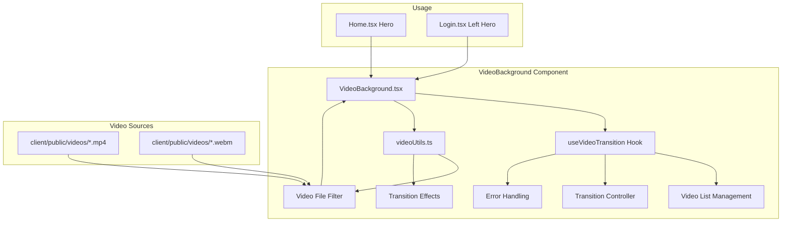
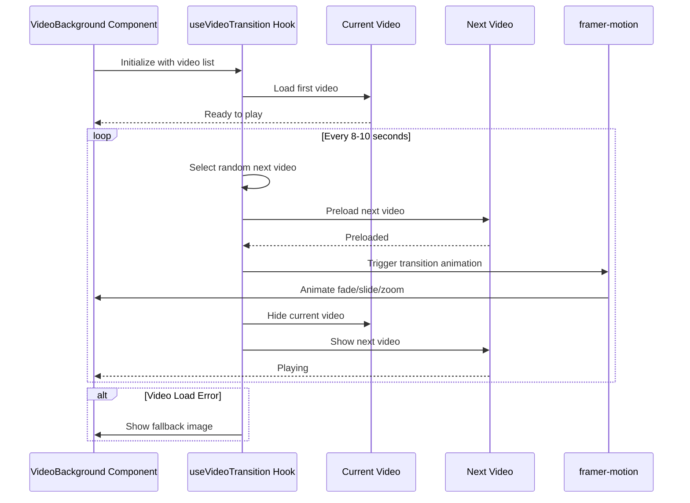

# Video Background Implementation Plan

## Overview
Implement a reusable video background component for Home.tsx and Login.tsx that displays random b-roll videos from `client/public/videos` with smooth transitions.

## Architecture



## Video Transition Flow



## Component Structure

### 1. VideoBackground Component (`client/src/components/shared/VideoBackground.tsx`)

```typescript
interface VideoBackgroundProps {
  overlayOpacity?: number;
  showAdirePattern?: boolean;
  showGradient?: boolean;
  transitionInterval?: number;
  className?: string;
  fallbackImage?: string;
}
```

**Features**:
- Random video selection
- Smooth transitions (fade, crossfade, zoom, slide)
- Auto-play, mute, loop
- Fallback to static images
- Responsive design

### 2. useVideoTransition Hook (`client/src/components/shared/useVideoTransition.ts`)

**Responsibilities**:
- Manage video list
- Handle video preloading
- Control transition timing
- Select random transition effects
- Handle errors

### 3. videoUtils (`client/src/components/shared/videoUtils.ts`)

**Functions**:
- `filterVideoFiles()`: Filter for .mp4 and .webm files
- `selectRandomVideo()`: Pick random video from list
- `getTransitionEffect()`: Select random transition type
- `preloadVideo()`: Preload video for smooth transition

## Transition Effects

| Effect | Description | Duration |
|--------|-------------|----------|
| Fade | Simple opacity transition | 1.5s |
| Crossfade | Two videos overlapping | 2s |
| Zoom | Scale effect during transition | 1.5s |
| Slide | Directional slide effect | 1.5s |

## Integration Points

### Home.tsx Changes
```tsx
// Before:
<div className="absolute inset-0 bg-cover bg-center bg-no-repeat"
     style={{ backgroundImage: "url('/images/hero-lagos-ride.png')" }} />

// After:
<VideoBackground
  showGradient={true}
  showAdirePattern={true}
  overlayOpacity={0.7}
  fallbackImage="/images/hero-lagos-ride.png"
/>
```

### Login.tsx Changes
```tsx
// Add VideoBackground component to left hero section
<div className="relative inset-0">
  <VideoBackground
    showGradient={false}
    showAdirePattern={false}
    overlayOpacity={0.5}
    fallbackImage="/images/lagos-skyline.png"
  />
  {/* Keep existing blur effects */}
</div>
```

## Video File Handling

### Available Videos
- 60+ mp4 files in `client/public/videos`
- Exclude: `Video Prompts - 50 Google Veo 3.md`

### Video Loading Strategy
1. Load initial video immediately
2. Preload next video while current is playing
3. Trigger transition when timer expires
4. Handle errors gracefully with fallback

## Performance Optimizations

1. **Lazy Loading**: Load videos on-demand
2. **Preloading**: Preload next video before transition
3. **Video Formats**: Use optimized mp4/webm formats
4. **Error Handling**: Fallback to static images
5. **Memory Management**: Clean up unloaded videos

## CSS Considerations

### Existing Classes to Preserve
- `.gradient-hero`: Nigeria Green gradient overlay
- `.adire-pattern`: SVG pattern overlay

### New Classes (if needed)
- `.video-background`: Base video container
- `.video-transition`: Transition animations
- `.video-fallback`: Fallback image styling

## Testing Checklist

- [ ] Videos load and play correctly
- [ ] Transitions are smooth and randomized
- [ ] Videos loop continuously
- [ ] Text remains readable over video
- [ ] Fallback images work on error
- [ ] Performance is acceptable
- [ ] Works on mobile devices
- [ ] Works on different screen sizes
